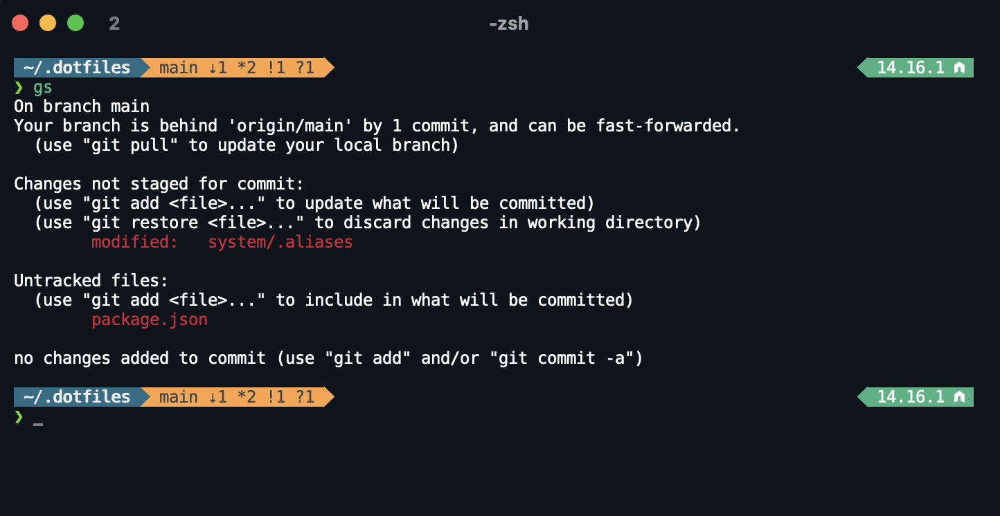
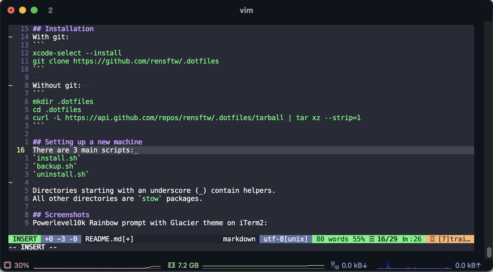

## Installation
With git:  
```
xcode-select --install
git clone https://github.com/rensftw/.dotfiles.git 
```
  
Without git:  
```
mkdir .dotfiles
cd .dotfiles
curl -L https://api.github.com/repos/rensftw/.dotfiles/tarball | tar xz --strip=1
```
  
## Setting up a new machine
There are 3 main scripts:
`install.sh`
`backup.sh`
`uninstall.sh`
  
Directories starting with an underscore (_) contain helpers.
All other directories are `stow` packages.
  
## Screenshots
[Powerlevel10k](https://github.com/romkatv/powerlevel10k/) Rainbow prompt with [Glacier](https://github.com/bahlo/iterm-colors#glacier) theme on [iTerm2](https://iterm2.com/):

  
Vim with [Dracula](https://draculatheme.com/vim) theme:


